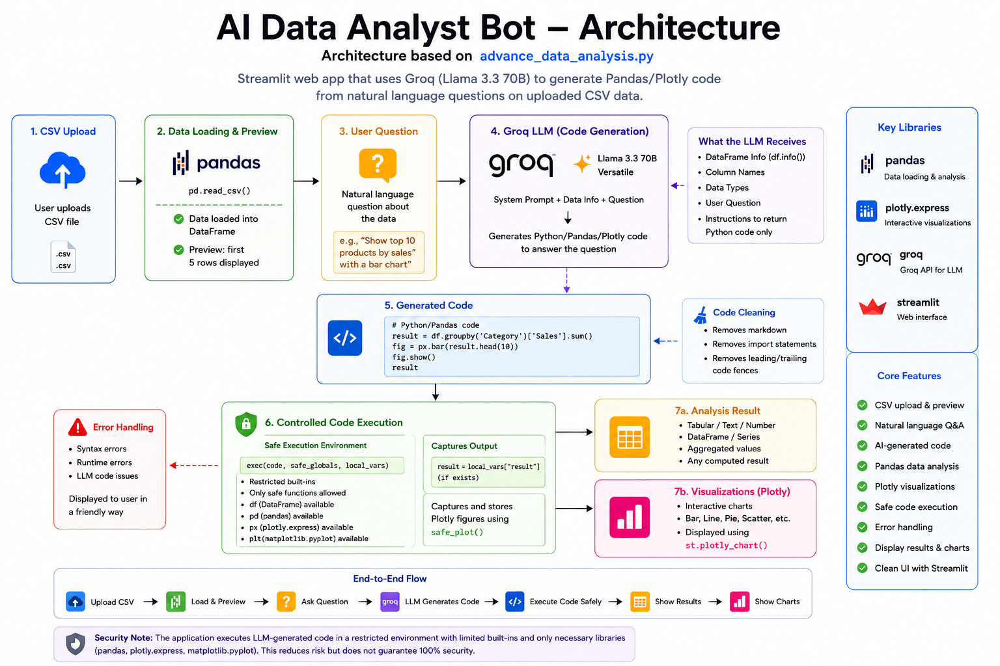
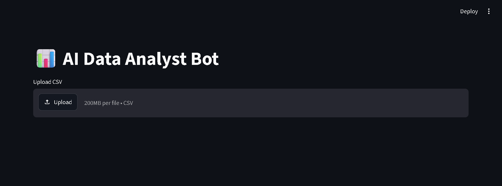
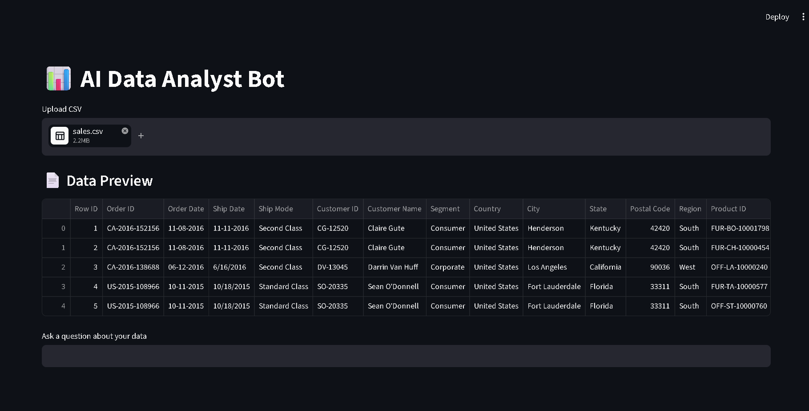
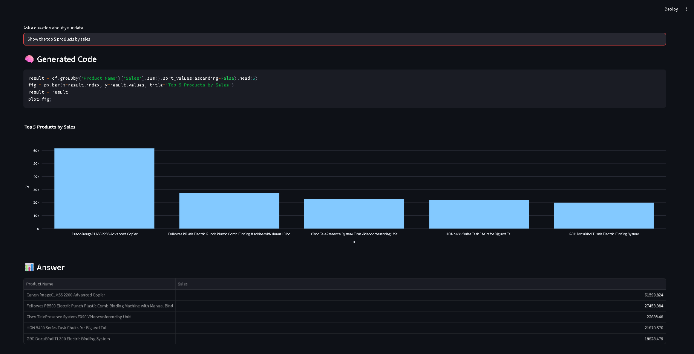
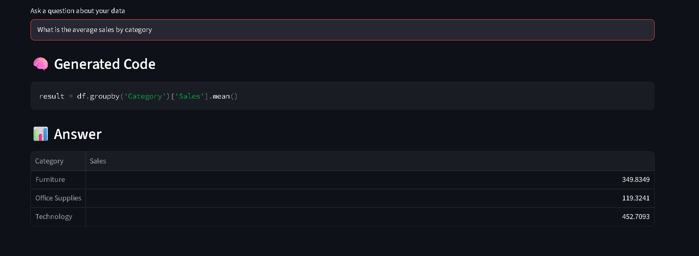
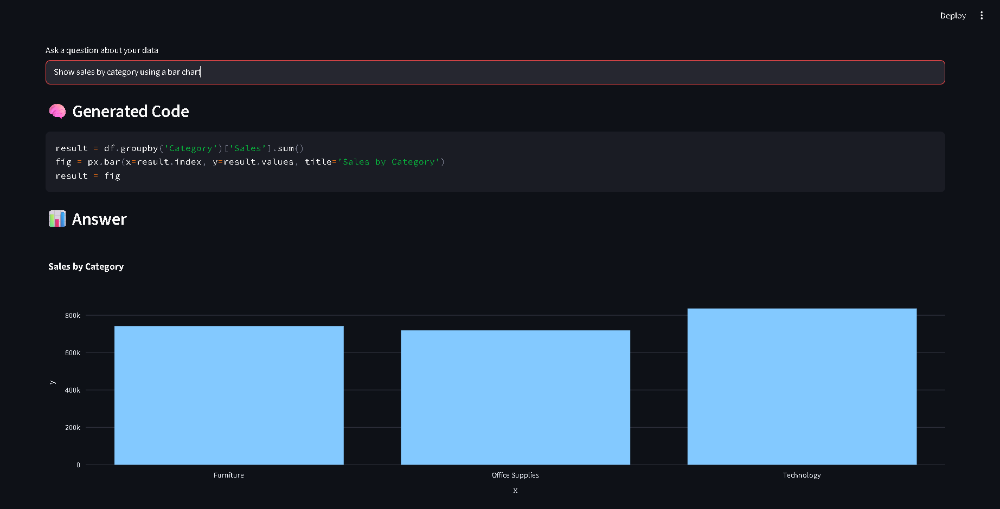
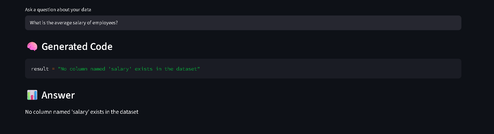

# 📊 AI Data Analyst Bot

An AI-powered data analysis application built with **Python, Streamlit, Groq, Pandas, and Plotly**. The application allows users to upload CSV datasets, ask questions about their data using natural language, and automatically generate Python/Pandas code to perform analysis and produce interactive visualizations.

The project also includes a separate **LangChain-based conversational chatbot** implementation.

---

## 🚀 Features

* 📁 **CSV File Upload** – Upload CSV datasets directly through the Streamlit interface.
* 👀 **Data Preview** – Preview the uploaded dataset before performing analysis.
* 🤖 **AI-Powered Analysis** – Uses Groq's Llama 3.3 70B model to understand natural-language questions.
* 💬 **Natural Language Queries** – Ask questions about your dataset without manually writing Python code.
* 🐼 **Automatic Pandas Code Generation** – AI generates Python/Pandas code based on the user's question.
* 🧹 **AI-Generated Code Cleaning** – Removes unnecessary Markdown formatting and import statements before execution.
* 🔐 **Restricted Code Execution** – Executes generated code with restricted built-ins and controlled variables.
* 📊 **Interactive Visualizations** – Uses Plotly Express to generate interactive charts.
* 🧠 **Generated Code Preview** – Displays the Python code generated by the AI.
* 📈 **Analysis Results** – Displays calculated values, tables, DataFrames, and other generated results.
* ⚠️ **Error Handling** – Handles syntax errors, runtime errors, and invalid AI-generated code.
* 💻 **Streamlit Interface** – Provides a simple and interactive web-based interface.

---

## 🛠️ Technologies Used

| Technology     | Purpose                                      |
| -------------- | -------------------------------------------- |
| Python         | Core programming language                    |
| Streamlit      | Web application and user interface           |
| Groq           | Large Language Model API                     |
| Llama 3.3 70B  | AI model for code generation and analysis    |
| Pandas         | Data loading, processing, and analysis       |
| Plotly Express | Interactive data visualization               |
| python-dotenv  | Environment variable management              |
| LangChain      | Conversational AI implementation in `app.py` |

---

## 🏗️ Project Structure

```text
AI-Data-Analyst-Bot/
│
├── app.py
├── data_analysis_bot.py
├── advance_data_analysis.py
│
├── data/
│   └── sales.csv
│
├── assets/
│   ├── architecture.png
│   ├── 01-home.png
│   ├── 02-data-preview.png
│   ├── 03-ai-code-generation.png
│   ├── 04-analysis-result.png
│   └── 05-visualization.png
│
├── .gitignore
└── README.md
```

### 📂 File Description

#### `app.py`

A separate conversational AI chatbot implementation using:

* LangChain
* Groq
* Llama 3.3 70B
* Streamlit
* Conversation history

It provides a chatbot-style interface with session-based conversation memory.

---

#### `data_analysis_bot.py`

A basic version of the AI-powered CSV data analysis application.

The user can:

1. Upload a CSV file.
2. Preview the dataset.
3. Enter a natural-language question.
4. Send the question to the Groq LLM.
5. Generate Python/Pandas code.
6. Execute the generated code.
7. Display the resulting analysis.

---

#### `advance_data_analysis.py`

The enhanced version of the AI Data Analyst application.

It adds:

* Plotly Express visualization support
* Interactive chart generation
* Session-based plot handling
* AI-generated code cleaning
* Restricted code execution
* Controlled execution variables
* Error handling
* Improved handling of AI-generated analytical code

This is the **main application represented by the system architecture diagram**.

---

#### `assets/architecture.png`

System architecture diagram showing the complete workflow of the advanced AI Data Analyst application.

---

#### `.gitignore`

Contains files and folders that should not be committed to GitHub, including:

* `.env`
* Virtual environments
* Python cache files
* IDE configuration
* Temporary files
* Local datasets
* Generated model files

---

## 🧠 System Architecture

The following architecture is based specifically on **`advance_data_analysis.py`** and illustrates how CSV data, natural-language questions, the Groq Llama 3.3 70B model, generated Python/Pandas code, restricted execution, and Plotly visualizations work together.

<p align="center">
  
</p>

---

## ⚙️ How It Works

1. The user uploads a CSV dataset through the Streamlit interface.
2. Pandas loads the CSV file into a DataFrame.
3. The application displays a preview of the dataset.
4. The user enters a question using natural language.
5. The application sends the dataset's column information, user question, and instructions to the Groq LLM.
6. Llama 3.3 70B generates Python/Pandas/Plotly code to answer the question.
7. The generated code is cleaned before execution.
8. Unnecessary Markdown formatting and import statements are removed.
9. The application executes the generated code using a restricted execution environment.
10. The resulting analysis is displayed to the user.
11. If the generated code creates a Plotly figure, the chart is displayed interactively.
12. Errors are caught and displayed through the Streamlit interface.

---

## 🔄 Application Workflow

1. **Upload CSV** – The user uploads a CSV dataset through the Streamlit interface.
2. **Load & Preview** – Pandas loads the dataset into a DataFrame and displays a preview.
3. **Ask a Question** – The user asks a question about the dataset using natural language.
4. **AI Code Generation** – Groq's Llama 3.3 70B receives the column information and question and generates Python/Pandas/Plotly code.
5. **Code Cleaning** – The generated code is cleaned by removing Markdown formatting and unnecessary imports.
6. **Restricted Execution** – The cleaned code is executed using a restricted execution environment.
7. **Analysis Result** – The generated result is displayed in the Streamlit interface.
8. **Visualization** – If the generated code creates a Plotly figure, the interactive chart is displayed.
9. **Error Handling** – Syntax and runtime errors are caught and displayed to the user.

---

## 📸 Application Screenshots

### 🏠 Main Application

<p align="center">
  
</p>

### 📁 CSV Upload & Data Preview

<p align="center">
  
</p>

### 🤖 AI Code Generation & Analysis

<p align="center">
  
</p>

### 📊 Analysis Results

<p align="center">
  
</p>

### 📈 Interactive Visualizations

<p align="center">
  
</p>

### ⚠️ Error Handling

<p align="center">
  
</p>

---

## 📊 Sample Dataset

The project includes a sample `sales.csv` dataset in the `data/` directory. The dataset is used to demonstrate the natural-language data analysis and interactive visualization capabilities of the application.

The dataset contains **9,994 records and 22 columns**, covering:

* 🧾 Order and shipping information
* 👤 Customer information
* 🌍 Geographic and regional information
* 🛍️ Product and category information
* 💰 Sales and profit
* 📦 Quantity
* 🏷️ Discount

The included dataset allows users to immediately test the application after cloning the repository.

---

## 💡 Example Questions

After uploading the `sales.csv` dataset, users can ask questions such as:

```text
What is the total sales?

Which category has the highest sales?

Show the top 10 products by sales.

What is the average sales by category?

Which region generated the highest profit?

Show sales by category using a bar chart.

What is the relationship between discount and profit?

Which sub-category has the highest profit?

Which city generated the highest sales?

Show the monthly sales trend using a line chart.
```

The application converts these natural-language questions into **Python/Pandas code** automatically.

For visualization-related questions, the generated code can also use **Plotly Express** to create interactive charts.


## 🔑 Environment Variables

The application uses a Groq API key.

Create a `.env` file in the project root:

```env
GROQ_API_KEY=your_groq_api_key
```

### ⚠️ Important

**Never upload your actual `.env` file or API key to GitHub.**

The `.gitignore` file is configured to prevent `.env` from being committed.

For example:

```gitignore
.env
```

You may optionally create a `.env.example` file containing:

```env
GROQ_API_KEY=your_groq_api_key_here
```

This file can safely be committed because it does not contain the real API key.

---

## 📦 Installation

### 1. Clone the Repository

```bash
git clone https://github.com/Vinutha-Reddy/AI-Data-Analyst-Bot.git
cd AI-Data-Analyst-Bot
```

### 2. Create a Virtual Environment

```bash
python -m venv venv
```

### 3. Activate the Virtual Environment

On Windows:

```bash
venv\Scripts\activate
```

On macOS/Linux:

```bash
source venv/bin/activate
```

### 4. Install Dependencies

```bash
pip install streamlit pandas python-dotenv langchain langchain-core langchain-community langchain-groq plotly
```

### 5. Configure the API Key

Create a `.env` file:

```env
GROQ_API_KEY=your_groq_api_key
```

---

## ▶️ Running the Application

### Advanced AI Data Analyst

This is the main and recommended version:

```bash
streamlit run advance_data_analysis.py
```

### Basic Data Analyst

```bash
streamlit run data_analysis_bot.py
```

### Conversational AI Chatbot

```bash
streamlit run app.py
```

After running the command, Streamlit will open the application in your browser.

---

## 🔐 Security Considerations

The application executes AI-generated Python code. Therefore, executing arbitrary generated code can introduce security risks.

The advanced implementation attempts to reduce these risks through:

* Removing import statements from generated code.
* Restricting available Python built-ins.
* Providing only required variables to the execution environment.
* Making the DataFrame available as the controlled `df` variable.
* Providing only required libraries such as Pandas and Plotly.
* Restricting plotting through a controlled plotting function.

### ⚠️ Important

The execution environment should be considered **restricted, not fully sandboxed**.

For production environments, AI-generated code should not be executed directly using Python `exec()` without stronger isolation, sandboxing, containerization, or other security controls.

---

## 🎯 Learning Outcomes

This project demonstrates practical experience with:

* Large Language Models (LLMs)
* Prompt engineering
* Groq API integration
* Llama 3.3 70B
* Natural-language-to-code generation
* Pandas data analysis
* Interactive data visualization
* Plotly Express
* Streamlit application development
* Session state management
* AI-generated code processing
* Controlled Python code execution
* Error handling
* Environment variable management

---

## 🔮 Future Improvements

* 📄 Support Excel, JSON, and SQL databases.
* 📊 Automatically generate multiple visualization types.
* 🧠 Add automatic dataset profiling and insights.
* 💬 Implement multi-turn conversations for data analysis.
* 🔍 Add advanced statistical analysis.
* 📥 Allow users to download generated reports.
* 📑 Generate PDF and Excel analysis reports.
* 🔐 Implement a fully isolated code-execution sandbox.
* ☁️ Deploy the application to Streamlit Cloud or another cloud platform.
* 🎨 Add a modern analytical dashboard.
* 🗃️ Support larger datasets through optimized processing.
* 📈 Add automatic correlation and trend analysis.

---

## 👩‍💻 Author

**Vinutha H R**

Computer Science & Engineering

Interested in **Java Backend Development, Software Engineering, Artificial Intelligence, Machine Learning, and Data Analytics**.

---
